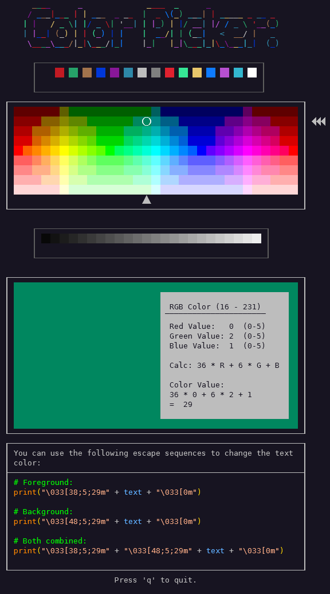

# Terminal Color Picker



This is a simple color picker for the terminal. It allows the user to pick a color from the 256 color palette within the terminal.
It can rather be used as a standalone tool using the ncolorpicker.sh script or as a TUI Control in its own curses screen.

## Usage

### Usage Standalone

The color picker uses unicurses and the UnicursesGuard from the unicguard module. To run the color picker as a standalone tool, you can use the ncolorpicker.sh script.
To install the dependencies, you can use the install.sh script.

```bash
sudo ./install.sh
```

After the installation, you can run the color picker using the `ncolorpicker` command.

You can also do the installation steps manually:

```bash
# Store Original Path
ORIGINAL_PATH=$(pwd)

# Install Python3 and pip
sudo apt-get install python3-pip

# Choose InstallPath
INSTALL_PATH=~/.terminal-colorpicker

# Create app directory in home folder
mkdir -p $INSTALL_PATH

# Clone repository
git clone https://github.com/derDere/terminal-colorpicker.git $INSTALL_PATH

# Goto the app directory
cd $INSTALL_PATH

# Install submodules
git submodule update --init --recursive

# Install Unicurses
./unicurses/install_unicurses.sh

# Create symbolic link
USR_LOCAL_BIN=~/.usr/local/bin
mkdir -p $USR_LOCAL_BIN
ln -s $INSTALL_PATH/ncolorpicker.sh $USR_LOCAL_BIN/ncolorpicker

# Add USR_LOCAL_BIN to PATH
echo 'export PATH=$PATH:$USR_LOCAL_BIN' >> ~/.bashrc
source ~/.bashrc

# Go back to the app directory
cd $ORIGINAL_PATH
```

### Usage as TUI Control

To use the color picker as a TUI Control, you can add the repository as a submodule to your project and import the ColorPicker class from the terminal-colorpicker module.
Because the color picker uses unicurses, you need to install the unicurses module to. This can be done from the unicguard submodule.
It is also strongly recommended to use the UnicursesGuard from the unicguard module to ensure that the terminal is in a good state after the program exits.

#### Add the submodule

Go into your project directory and run the following command to add the terminal-colorpicker as a submodule:

```bash
git submodule add https://github.com/derDere/terminal-colorpicker.git terminal_colorpicker
```

#### Import and use the ColorPicker class with UnicursesGuard

After adding the submodule, you can import the ColorPicker class from the terminal-colorpicker module and use it in your project.
It is strongly recommended to use the UnicursesGuard from the unicguard module to ensure that the terminal is in a good state after the program exits.
After creating the screen with the UnicursesGuard, you can create a ColorPicker object and run it.

```python
from unicguard import UnicursesGuard
from terminal_colorpicker import ColorPicker

with UnicursesGuard() as stdscr:
  color_picker = ColorPicker(stdscr)
  color_picker.run()
```

## License

This project is licensed under the GNU General Public License v3.0 - see the [LICENSE](LICENSE) file for details.

## Author

This project was created by [derDere](https://github.com/derDere)
